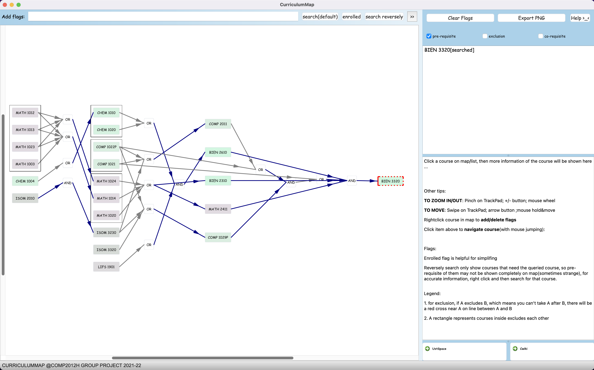

# Curriculum Map

A visualization solution for curriculum and course relationships of the Hong Kong University of Science and Technology (HKUST) [](https://github.com/zory233/CurriculumMap/releases)



## Installation

- Download the program
  - Windows [](https://github.com/Zory123/CurriculumMap/releases/tag/v1.0)
  - macOS [](https://github.com/Zory123/CurriculumMap/releases/tag/v1.0)
  - Linux [](https://github.com/Zory123/CurriculumMap/releases/tag/v1.0)
- Download `courses.csv` and replace `/get-information/courses.csv`
  - The ones contained in above three files are for 2021-22, and the new `courses.csv` is for 2022-23
- (Optional) Download `get-information.py` and replace `/get-information/get-information.py`. If you think the  `/get-information/courses.csv` is obsolete and want to update it manually, please run (no need to set the url)
  ```shell
  python /get-information/get-information.py
  ```
  - If you want to update using the old `/get-information/get-information.py`, please modify the code by setting `base_url` (e.g., `= ['https://prog-crs.ust.hk/ugcourse/2021-22/']`)

## Building

Clone this repo

Dependencies:

- Qt Kit v6.1.1 and above (not the creator's version).
- We haven’t use any third-party library except for Qt library, so just compile it would be fine.

After building the project, copy `/get-information/courses.csv` to `/build-<blablabla>/`

## Using CurriculumMap

### Hints

TO ZOOM IN/OUT: Pinch on TrackPad; +/- button; mouse wheel

TO MOVE: Swipe on TrackPad; arrow button ;mouse hold&move

Rightclick course in map to add/delete flags 

Click item above to navigate course(with mouse jumping):

### Flags

Enrolled flag is helpful for simplifing

Reversely search only show courses that need the queried course, so pre-requisite of them may not be shown completely on map(sometimes strange), for accurate imformation, right click and then search for that course.

### Legend

1. for exclusion, if A excludes B, which means you can't take A after B, there will be a red cross near A on line between A and B

2. A rectangle represents courses inside excludes each other


More information about project source structure -> `/project_doc_H26.pdf`

---

insteresting course code: BIEN3320

## Contributor:

XU, Han

WANG, Yucheng

WANG, Yicheng

ZHANG, Yujun


